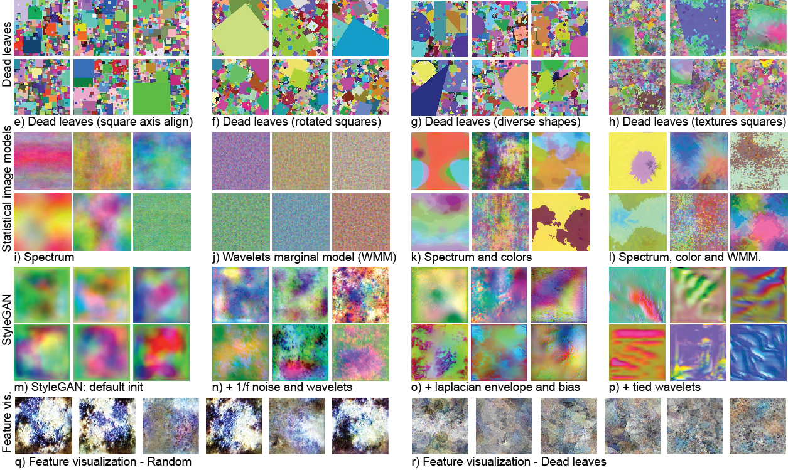

# Dataset generation
We provide scripts to generate the datasets in the paper, see Figure 2 for examples of each script. The datasets are also available for download in `scripts/download_datasets`. 
To install requirements specific for the dataset generation, install the requirements in this folder:

`pip install -r requirements.txt`

# Large scale/small scale
To generate the datasets in small-scale (128x128 resolution and 105k samples), 
run the commands as they appear below with `--small-scale`.
To generate the same datasets but at large scale, simply add `--large-scale` (256x256 resolution and 1.3M samples). 

For some of the datasets, you can use the `--parallel` command to generate the samples in parallel (see the help for each generation script). For custom number of samples, resolution, and other options 
see the arguments for the scripts for each dataset type. 

All scripts should be run from the folder where this README.md is located. For reference of each datasets, see the following Figure:

## Dead leaves
For e) Dead leaves squares use:

`python dead_leaves/generate_dataset.py --small-scale --shape-model square`

For f) Dead leaves rotated squares use:

`python dead_leaves/generate_dataset.py --small-scale --shape-model oriented_square`

For g) Dead leaves mixed use:

`python dead_leaves/generate_dataset.py --small-scale --shape-model mixed`

For h) Dead leaves mixed with texture, first execute the statistical image model l) Spectrum + Color + WMM model in the following seciton and then use:

`python dead_leaves/generate_dataset.py --small-scale --shape-model mixed --textured --texture-folder ../generated_datasets/small_scale/stat-spectrum_color_wmm/train`

## Statistical Image models
We provide a MATLAB and python implementation for this process. The original datasets 
used in the paper (and available for download) were generated with the MATLAB implementation. 
The following code is a python port from the original Matlab implementation, which visually matches the MATLAB implementation. 
Models trained with the python version of the code have not been tested. 

For i) Spectrum images use:

`python statistical/generate_dataset.py --small-scale --impose_spectrum True`

For j) Wavelet Marginal Model images use:

`python statistical/generate_dataset.py --small-scale --impose_wmm True`

For k) Specrum + Color images use:

`python statistical/generate_dataset.py --small-scale --impose_spectrum True --impose_color_model True`

For l) Spectrum + Color + WMM model images use:

`python statistical/generate_dataset.py --small-scale --impose_spectrum True --impose_color_model True --impose_wmm True`

#### Matlab implementation
We also provide the original Matlab implementation used in the paper under 
`statistical/matlab`. The python code replicates the Matlab implementation. See `generate.sh` in the folder for how to execute.

## StyleGAN v2 generation
Install the dependencies required by the default stylegan2-ada-pytorch repo, as found in
https://github.com/NVlabs/stylegan2-ada-pytorch

Then, for m) StyleGAN default:

`python stylegan/generate_dataset.py --small-scale --network_type original`

<!-- 
n) StyleGAN High Frequency:

`python stylegan/generate_dataset.py`

o) StyleGAN Sparse:

`python stylegan/generate_dataset.py `
-->

p) StyleGAN Oriented:

`python stylegan/generate_dataset.py --small-scale --network_type sparse_new --random_configuration 'chin-chout' --same_noise_map --bias_range 0.2`

## Feature visualizations
For q) Random, use:

`python feature_visualizations/generate_dataset.py --small-scale --random-init`

For f) Dead leaves, download the MoCo v2 trained model on dead leaves using the model scripts (or train your own), and then use:

`python feature_visualizations/generate_dataset.py --small-scale --checkpoint ../encoders/large_scale/dead_leaves-mixed/checkpoint_0199.pth.tar`